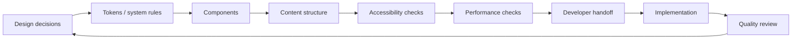
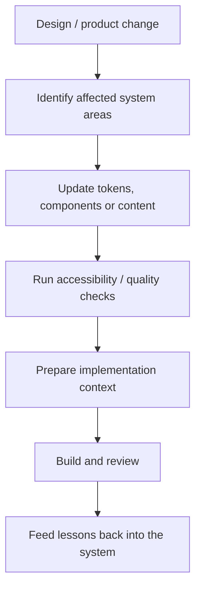
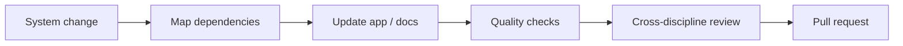

<div align="center">

# DesignOps Orchestrator

**Public design-to-engineering systems work connecting design tokens, content, accessibility, performance, and production handoff.**


[Portfolio](https://nischhalsubba.com.np/) · [Browse app](./app) · [Technical README](./app/README.md) · [Issues](https://github.com/Nischhalsubba/design-ops-orchestrator/issues)

</div>

## Overview

**DesignOps Orchestrator** explores how product-design decisions can remain connected as work moves from design systems and content into accessibility checks, performance considerations, implementation, and handoff.

| Audience | Primary value |
|---|---|
| Designers | Keep tokens, components, content and interaction intent connected |
| Developers | Receive clearer implementation contracts and reviewable system inputs |
| Product teams | See dependencies and quality gates across delivery |
| Reviewers | Understand how design decisions move toward production |

## What this demonstrates

This repository is intentionally inspectable proof of the systems side of my product-design practice. The useful evidence is not a finished screen. It is the relationship between design rules, implementation inputs, quality gates, and release work.

| Capability | Public evidence | What it demonstrates |
|---|---|---|
| Design-system continuity | Token workflow plus the architecture documented in [`app/README.md`](./app/README.md) | Design decisions can move toward code as explicit, reviewable system inputs rather than screenshots alone |
| Accessibility and performance gates | `npm run test:a11y`, `npm run test:perf`, and `npm run audit` in [`app/package.json`](./app/package.json) | Quality requirements are treated as part of delivery, not a final visual review |
| Implementation-aware handoff | Build, lint, token, content, media, and motion tasks in the application workspace | Handoff includes behavior, assets, constraints, and automation that engineering can inspect |
| Release discipline | `npm run build`, `npm run check`, `npm run deploy`, and `npm run release` | The system connects design operations to repeatable production-oriented checks and release tasks |

**Evidence boundary:** this is public systems work and workflow tooling. It demonstrates design-to-engineering thinking, implementation literacy, and quality-gate design; it does not stand in for client-product outcomes or claim business metrics that are not present in the repository.

<details open>
<summary><strong>🏗️ Interactive DesignOps architecture</strong></summary>



</details>

## Workflow



## Repository map

- [`app/`](./app) — maintained application and deeper technical documentation.
- [`app/package.json`](./app/package.json) — public task surface for tokens, linting, accessibility, performance, build, deployment, and release checks.
- [`.github/`](./.github) — repository automation.

## Getting started

```bash
git clone https://github.com/Nischhalsubba/design-ops-orchestrator.git
cd design-ops-orchestrator/app
```

Use the package manager and scripts declared inside the application workspace. See [`app/README.md`](./app/README.md) for branch-specific implementation details.

## Design principles

Prefer explicit system relationships over isolated screens. Document state, responsive behavior, content rules, accessibility expectations, component boundaries, and implementation constraints where they are actionable.

## SEO & discoverability

The repository is described naturally with terms such as **DesignOps, design systems, design tokens, accessibility, developer handoff, content systems, product design workflow, and design-to-development collaboration**. Public pages should also maintain accurate titles, descriptions, semantic headings, social metadata, and indexable explanatory content.

## Contribution flow


