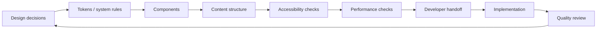
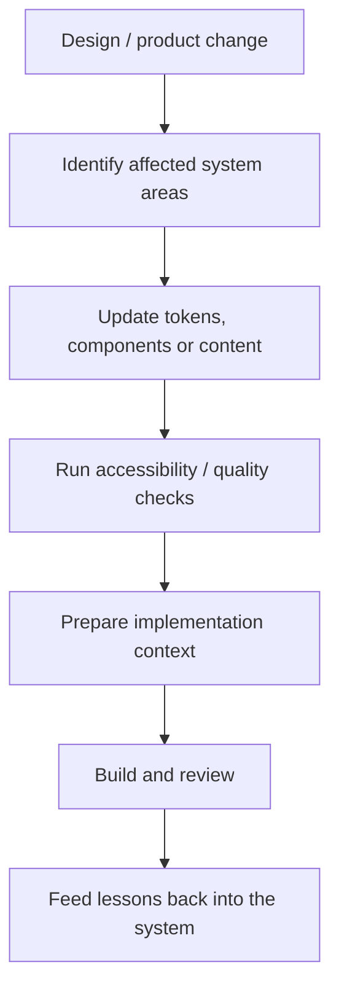
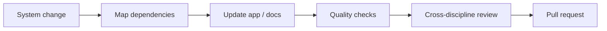

<div align="center">

# DesignOps Orchestrator

**A connected workflow for design tokens, content, accessibility, performance, and production handoff.**


[Browse app](./app) · [Technical README](./app/README.md) · [Issues](https://github.com/Nischhalsubba/design-ops-orchestrator/issues)

</div>

## Overview

**DesignOps Orchestrator** explores how product-design decisions can remain connected as work moves from design systems and content into accessibility checks, performance considerations, implementation, and handoff.

| Audience | Primary value |
|---|---|
| Designers | Keep tokens, components, content and interaction intent connected |
| Developers | Receive clearer implementation contracts and reviewable system inputs |
| Product teams | See dependencies and quality gates across delivery |
| Reviewers | Understand how design decisions move toward production |

<details open>
<summary><strong>🏗️ Interactive DesignOps architecture</strong></summary>



</details>

## Workflow



## Repository map

- [`app/`](./app) — maintained application and deeper technical documentation.
- [`.github/`](./.github) — repository automation.

## Getting started

```bash
git clone https://github.com/Nischhalsubba/design-ops-orchestrator.git
cd design-ops-orchestrator/app
```

Use the package manager and scripts declared inside the application workspace. See [`app/README.md`](./app/README.md) for branch-specific implementation details.

## Design principles

Prefer explicit system relationships over isolated screens. Document state, responsive behavior, content rules, accessibility expectations, component boundaries, and implementation constraints where they are actionable.

## SEO & discoverability

The repository is described naturally with terms such as **DesignOps, design systems, design tokens, accessibility, developer handoff, content systems, product design workflow, and design-to-development collaboration**. Public pages should also maintain accurate titles, descriptions, semantic headings, social metadata, and indexable explanatory content.

## Contribution flow


