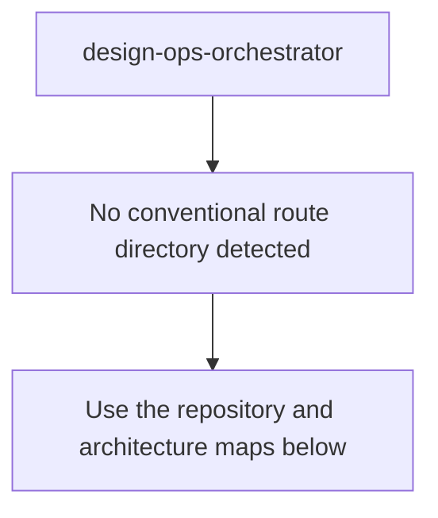
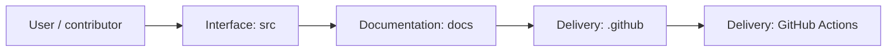
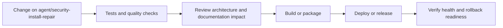
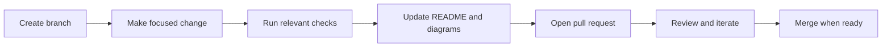

<!-- interactive-readme-standard:start -->

<div align="center">

# design-ops-orchestrator

**Branch-aware technical guide for [`agent/security-install-repair`](https://github.com/Nischhalsubba/design-ops-orchestrator/tree/agent/security-install-repair)**

<p>      </p>

<p>
  <a href="https://github.com/Nischhalsubba/design-ops-orchestrator/tree/agent/security-install-repair"><strong>Browse source</strong></a> ·
  <a href="https://github.com/Nischhalsubba/design-ops-orchestrator/issues"><strong>Issues</strong></a> ·
  <a href="https://github.com/Nischhalsubba/design-ops-orchestrator/codespaces/new?ref=agent%2Fsecurity-install-repair"><strong>Open in Codespaces</strong></a>
</p>

</div>

> [!IMPORTANT]
> This guide is generated from the files actually present on `agent/security-install-repair`. It links to detected source paths, preserves project-authored notes, and avoids claiming components that were not found.

## At a glance

| Item | Detected value |
|---|---|
| Purpose | A modular Gulp 5 pipeline for design tokens, content, media, motion, accessibility audits, and front-end release automation. |
| Branch role | Compared with `main` |
| Stack | JavaScript, Sass, TypeScript, HTML, CSS |
| Manifests | package.json |
| Prerequisites | Node.js |
| Delivery | GitHub Actions |
| License | No license file detected |

## Branch scope

This branch differs from the default branch in the following detected paths:

- [`.eslintrc.cjs`](https://github.com/Nischhalsubba/design-ops-orchestrator/blob/agent/security-install-repair/.eslintrc.cjs)
- [`.github/workflows/security-install-repair.yml`](https://github.com/Nischhalsubba/design-ops-orchestrator/blob/agent/security-install-repair/.github/workflows/security-install-repair.yml)
- [`.security-audit-summary.json`](https://github.com/Nischhalsubba/design-ops-orchestrator/blob/agent/security-install-repair/.security-audit-summary.json)
- [`.security-build.log`](https://github.com/Nischhalsubba/design-ops-orchestrator/blob/agent/security-install-repair/.security-build.log)
- [`.security-ci.log`](https://github.com/Nischhalsubba/design-ops-orchestrator/blob/agent/security-install-repair/.security-ci.log)
- [`.security-direct-dependency-check.json`](https://github.com/Nischhalsubba/design-ops-orchestrator/blob/agent/security-install-repair/.security-direct-dependency-check.json)
- [`.security-fsevents.json`](https://github.com/Nischhalsubba/design-ops-orchestrator/blob/agent/security-install-repair/.security-fsevents.json)
- [`.security-install.log`](https://github.com/Nischhalsubba/design-ops-orchestrator/blob/agent/security-install-repair/.security-install.log)
- [`.security-lint.log`](https://github.com/Nischhalsubba/design-ops-orchestrator/blob/agent/security-install-repair/.security-lint.log)
- [`.security-lock.log`](https://github.com/Nischhalsubba/design-ops-orchestrator/blob/agent/security-install-repair/.security-lock.log)
- [`.security-validation-status.txt`](https://github.com/Nischhalsubba/design-ops-orchestrator/blob/agent/security-install-repair/.security-validation-status.txt)
- [`gulp/tasks/admin.js`](https://github.com/Nischhalsubba/design-ops-orchestrator/blob/agent/security-install-repair/gulp/tasks/admin.js)

## Quick start

```bash
npm install
npm run start
npm run build
npm run lint
```

### Configuration surface

- No committed environment example file was detected.

> Never commit secrets, private keys, production credentials, customer data, or unredacted infrastructure details.

## Repository map

```mermaid
flowchart TD
    ROOT["design-ops-orchestrator / agent/security-install-repair"]
    ROOT --> P0[".github/"]
    ROOT --> P1["css/"]
    ROOT --> P2["docs/"]
    ROOT --> P3["gulp/"]
    ROOT --> P4["js/"]
    ROOT --> P5["src/"]
    ROOT --> P6[".DS_Store"]
    ROOT --> P7[".eslintrc.cjs"]
    ROOT --> P8[".security-audit-summary.json"]
    ROOT --> P9[".security-build.log"]
    ROOT --> P10[".security-ci.log"]
    ROOT --> P11[".security-direct-dependency-check.json"]
    ROOT --> P12[".security-fsevents.json"]
    ROOT --> P13[".security-install.log"]
    ROOT --> P14[".security-lint.log"]
    ROOT --> P15[".security-lock.log"]
    ROOT --> P16[".security-validation-status.txt"]
    ROOT --> P17["gulpfile.js"]
    ROOT --> MORE["+ 7 more top-level entries"]
```



| Responsibility | Detected source paths |
|---|---|
| Interface | [`src`](https://github.com/Nischhalsubba/design-ops-orchestrator/tree/agent/security-install-repair/src) |
| Documentation | [`docs`](https://github.com/Nischhalsubba/design-ops-orchestrator/tree/agent/security-install-repair/docs) |
| Delivery | [`.github`](https://github.com/Nischhalsubba/design-ops-orchestrator/tree/agent/security-install-repair/.github) |

## Website or application map



## Architecture and responsibility flow




## Quality, security, and operations

<table>
<tr>
<td width="33%" valign="top">

### Quality

- No conventional test directory was detected automatically.

Detected commands:
- `npm run start`
- `npm run build`
- `npm run lint`

</td>
<td width="33%" valign="top">

### Security

- No dedicated security policy or automated dependency configuration was detected.

Review authentication, authorization, input validation, dependency updates, secret handling, and failure recovery before release.

</td>
<td width="34%" valign="top">

### Observability

- No dedicated observability integration was detected automatically.

Define useful logs, metrics, traces, alerts, and rollback signals for production-facing branches.

</td>
</tr>
</table>

## Delivery flow



### Automation detected

- [`.github/workflows/apply-interactive-readme.yml`](https://github.com/Nischhalsubba/design-ops-orchestrator/blob/agent/security-install-repair/.github/workflows/apply-interactive-readme.yml)
- [`.github/workflows/security-install-repair.yml`](https://github.com/Nischhalsubba/design-ops-orchestrator/blob/agent/security-install-repair/.github/workflows/security-install-repair.yml)

## Contribution flow



- Keep changes focused and explain architectural consequences.
- Run the checks relevant to the changed area.
- Update diagrams whenever routes, modules, data models, authentication, jobs, or delivery paths change.
- Add screenshots or recordings for visual behavior changes when useful.
- Use issues for reproducible defects and pull requests for reviewable changes.

## Ownership and support

| Topic | Source |
|---|---|
| Repository | [`Nischhalsubba/design-ops-orchestrator`](https://github.com/Nischhalsubba/design-ops-orchestrator) |
| Branch | [`agent/security-install-repair`](https://github.com/Nischhalsubba/design-ops-orchestrator/tree/agent/security-install-repair) |
| Ownership | No CODEOWNERS file detected |
| Contributing | Use the contribution flow above |
| Support | [Open or review issues](https://github.com/Nischhalsubba/design-ops-orchestrator/issues) |
| License | No license file detected |

<details>
<summary><strong>Documentation maintenance checklist</strong></summary>

- [ ] Purpose and branch scope are accurate.
- [ ] Setup and configuration commands still work.
- [ ] Repository, application, API, data, authentication, job, and deployment diagrams match the code.
- [ ] Tests, security controls, observability, and rollback behavior are documented.
- [ ] Links point to real files on this branch.
- [ ] No secrets or private operational details are exposed.

</details>

<!-- interactive-readme-standard:end -->

<!-- project-authored-notes:start -->
<details>
<summary><strong>Project-authored notes preserved from this branch</strong></summary>

# DesignOps Orchestrator v4.1

> A Gulp 5-based DesignOps workflow for turning design tokens, content, media, markup, styles, scripts, audits, and release tasks into a structured front-end production pipeline.

[](LICENSE)
[](https://gulpjs.com/)
[]()
[]()
[](https://github.com/Nischhalsubba/design-ops-orchestrator)

---

## Table of Contents

- [Overview](#overview)
- [The DesignOps Problem](#the-designops-problem)
- [Designer's Perspective](#designers-perspective)
- [Why Gulp in a Modern Workflow?](#why-gulp-in-a-modern-workflow)
- [Core Features](#core-features)
- [System Architecture](#system-architecture)
- [Available Scripts](#available-scripts)
- [Installation and Setup](#installation-and-setup)
- [Workflow Engines](#workflow-engines)
- [Tool Integration Matrix](#tool-integration-matrix)
- [AI-Assisted Error Handling](#ai-assisted-error-handling)
- [Quality and Audit System](#quality-and-audit-system)
- [Recommended Usage](#recommended-usage)
- [Troubleshooting Guide](#troubleshooting-guide)
- [Roadmap](#roadmap)
- [Maintainer](#maintainer)

---

## Overview

**DesignOps Orchestrator** is a modular Gulp 5 workflow created to reduce the manual friction between design tools, content sources, motion assets, media exports, and production-ready front-end code.

The project is designed around a simple idea:

> Designers and developers should not waste time manually copying tokens, compressing images, rebuilding sprites, moving animation files, auditing pages, and packaging releases by hand.

This repository uses Gulp as an orchestration layer. It is not trying to replace every modern bundler or framework. Instead, it coordinates the operational tasks that sit around front-end production:

- token transformation
- Sass/CSS processing
- JavaScript/TypeScript bundling
- Pug/HTML generation
- Markdown/content ingestion
- image optimization
- AVIF/WebP generation
- SVG sprite generation
- Lottie/Rive motion handling
- accessibility audits
- performance audits
- linting
- release packaging
- changelog/versioning workflows
- optional AI-assisted error explanation

---

## The DesignOps Problem

Design and development drift happens when the design source of truth and the production source of truth slowly separate.

Common examples:

- A designer updates a Figma token, but CSS variables are not updated.
- A content writer updates a Notion page, but the website still shows old content.
- An animator exports a new Lottie file, but the runtime asset stays outdated.
- A developer ships a page without checking accessibility.
- A release is packaged manually and inconsistently.

DesignOps Orchestrator exists to reduce that drift by creating a repeatable workflow where exported design intent can move into code with less manual work.

---

## Designer's Perspective

This project is written from the perspective of a product designer who knows enough coding to care deeply about handoff quality.

The goal is not only automation for automation’s sake. The goal is to make the workflow feel cleaner for both designers and developers.

The workflow is useful when a team wants to:

- keep design tokens synchronized
- produce optimized assets automatically
- use static content sources without adding a CMS
- make audits part of normal development
- reduce repetitive manual file operations
- keep front-end projects structured
- build a repeatable foundation for design-heavy websites

The best design systems are not just Figma files. They are living pipelines between design decisions and shipped interfaces.

---

## Why Gulp in a Modern Workflow?

Modern tools like Vite, Webpack, Next.js, and Astro are excellent for application bundling and page frameworks.

Gulp is different. Gulp is a **task runner**.

That makes it useful for orchestration tasks such as:

1. resizing and converting large image batches
2. generating AVIF/WebP assets
3. creating SVG sprites
4. transforming design tokens
5. parsing Markdown into JSON
6. moving/copying files between folders
7. packaging releases
8. running audits
9. generating reports
10. automating repetitive build tasks

This project uses Gulp as the operational layer around design-to-code workflows.

---

## Core Features

- **Design Token Engine** — converts token JSON into Sass variables.
- **Content Engine** — processes Markdown/frontmatter into generated content data.
- **Motion Engine** — handles Lottie/Rive-style animation assets.
- **Visual Engine** — optimizes and transforms image assets.
- **SVG Engine** — minifies SVGs and can generate sprites.
- **Styles Engine** — compiles Sass and PostCSS workflows.
- **Scripts Engine** — supports Babel, TypeScript, ESBuild, and minification workflows.
- **Audit Engine** — supports accessibility and performance checks.
- **Lint Engine** — runs JavaScript, Sass/SCSS, and template linting workflows.
- **Release Engine** — supports versioning, tagging, zipping, and changelog-style tasks.
- **AI-Assisted Error Handling** — uses Google GenAI tooling when configured to explain build errors.

---

## System Architecture

```bash
root/
├── .env                  # Local secrets and API keys
├── gulpfile.js           # Main task entry point
├── package.json          # Scripts and dependencies
├── gulp/                 # Modular workflow tasks
│   ├── config.js         # Paths and global settings
│   ├── tasks/
│   │   ├── admin.js      # Versioning, TODOs, zip/release helpers
│   │   ├── assets.js     # Images, fonts, sprites, static assets
│   │   ├── audit.js      # Lighthouse, Axe/Pa11y-style audits
│   │   ├── content.js    # Markdown/frontmatter/content transformation
│   │   ├── lint.js       # ESLint, Stylelint, Pug linting
│   │   ├── markup.js     # Pug/template generation
│   │   ├── media.js      # Responsive media/image operations
│   │   ├── motion.js     # Lottie/Rive/motion asset handling
│   │   ├── scripts.js    # JS/TS bundling and minification
│   │   ├── server.js     # BrowserSync/local development server
│   │   ├── styles.js     # Sass/PostCSS/CSS optimization
│   │   └── tokens.js     # JSON token to SCSS workflow
│   └── utils/
│       └── ai-healer.js  # AI-assisted error explanation helper
└── src/
    ├── assets/
    │   ├── animation/    # Lottie/Rive or motion files
    │   ├── icons/        # SVG icons for sprite/minification
    │   ├── img/          # Source PNG/JPG images
    │   └── video/        # Source videos
    ├── data/             # Site/project data
    ├── ingest/
    │   └── content/      # Markdown content input
    ├── markup/           # Pug/templates/pages
    ├── scripts/          # TypeScript/JavaScript source
    ├── styles/           # SCSS source
    └── tokens/           # Design token JSON files
```

---

## Available Scripts

| Command | Purpose |
|---|---|
| `npm start` | Runs the default Gulp development workflow |
| `npm run build` | Runs production build workflow |
| `npm run deploy` | Runs deployment task if configured |
| `npm run lint` | Runs lint tasks |
| `npm run audit` | Runs audit tasks |
| `npm run tokens` | Runs token transformation task |
| `npm run todo` | Scans TODO-style tasks if configured |
| `npm run release` | Runs minor release/versioning workflow |
| `npm run test:a11y` | Runs accessibility audit task |
| `npm run test:perf` | Runs performance audit task |

---

## Installation and Setup

### 1. Clone the Repository

```bash
git clone https://github.com/Nischhalsubba/design-ops-orchestrator.git
cd design-ops-orchestrator
```

### 2. Install Dependencies

```bash
npm install
```

### 3. Configure Environment

Create a `.env` file in the root directory:

```bash
touch .env
```

Optional environment variables:

```env
API_KEY=your_google_genai_key_here
ANALYTICS_ID=G-XXXXXXXXXX
```

### 4. Start the Workflow

```bash
npm start
```

The development workflow is intended to:

- compile source assets
- start a local server
- watch source folders
- rebuild changed files
- provide task-level feedback in the terminal

---

## Workflow Engines

### Design Token Engine

**Goal:** reduce manual CSS/token updates.

- **Input:** `src/tokens/tokens.json`
- **Output:** generated SCSS token file
- **Use case:** Figma Tokens Studio export to SCSS variables

Example transformation:

```json
{
  "global": {
    "colors": {
      "primary": "#000000"
    }
  }
}
```

Becomes a Sass-style token such as:

```scss
$global-colors-primary: #000000;
```

### Content Engine

**Goal:** use Markdown as structured static content.

- **Input:** `src/ingest/content/*.md`
- **Output:** generated content JSON or markup-ready data

Recommended frontmatter:

```yaml
---
title: My Article
date: 2026-01-01
tags: [design, ops]
---
```

### Motion Engine

**Goal:** make animation assets part of the build pipeline.

- **Input:** `src/assets/animation/*.json` or `.riv`
- **Output:** optimized animation assets and optional manifest data

Useful for:

- Lottie JSON files
- Rive binary files
- motion asset copying/minification
- runtime discovery of available animation assets

### Visual Engine

**Goal:** automate image optimization.

- **Input:** source image files
- **Output:** optimized image formats and responsive variants

Supported workflow direction includes:

- AVIF generation
- WebP generation
- original fallback optimization
- responsive image sizing
- SVG minification
- sprite generation

### Audit Engine

**Goal:** catch accessibility and performance issues earlier.

Potential audit outputs include:

- accessibility reports
- performance reports
- HTML validation reports
- Lighthouse-style output
- Pa11y/Axe-style checks

---

## Tool Integration Matrix

| Tool Category | Tool | Export As | Suggested Destination |
|---|---|---|---|
| UI Design | Figma | JSON tokens / SVG | `src/tokens/`, `src/assets/icons/` |
| UI Design | Sketch | JSON / SVG | `src/tokens/`, `src/assets/icons/` |
| Whiteboard | FigJam | PNG / PDF | `src/assets/img/` |
| Whiteboard | Miro | PNG / PDF | `src/assets/img/` |
| Creative | Photoshop | JPG / PNG | `src/assets/img/` |
| Creative | Illustrator | SVG | `src/assets/icons/` |
| Motion | Rive | `.riv` | `src/assets/animation/` |
| Motion | After Effects / Bodymovin | Lottie JSON | `src/assets/animation/` |
| Prototype | ProtoPie / Principle | MP4 / WebM | `src/assets/video/` |
| Content | Notion | Markdown | `src/ingest/content/` |
| Content | Obsidian | Markdown | `src/ingest/content/` |
| Docs | Google Docs | Markdown / HTML | `src/ingest/content/` |
| Analytics | GA4 | Tracking ID | `.env` or data config |

---

## AI-Assisted Error Handling

The project includes an AI-assisted error explanation direction using Google GenAI tooling.

When configured with an API key, the helper can be used to explain build failures or stack traces in a more human-readable way.

Example use case:

1. Sass or JS task fails.
2. Error handler captures the message/stack trace.
3. AI helper explains likely cause and possible fix.
4. Developer gets a clearer debugging path in the terminal.

### Environment Requirement

```env
API_KEY=your_google_genai_key_here
```

This should be treated as a developer-assistance layer, not as a replacement for reading the error or understanding the build system.

---

## Quality and Audit System

The dependency list includes tools for:

- ESLint
- Stylelint
- Pug linting
- W3C HTML validation
- accessibility checks
- Lighthouse audits
- Pa11y audits
- CSS minification
- JS minification
- image optimization
- sitemap generation
- critical CSS workflows

This makes the project useful as a quality-control pipeline, not only a local dev server.

---

## Recommended Usage

Use this workflow for projects that need many design-to-code operations, such as:

- static marketing websites
- portfolio systems
- design-system prototypes
- documentation sites
- design-heavy landing pages
- sites that use many media assets
- projects with exported Figma tokens
- projects using Markdown content
- front-end builds requiring audits and release packaging

Avoid using it when a tiny static page has no need for a build pipeline. This tool is most valuable when repeatable operations start becoming manual work.

---

## Troubleshooting Guide

### `gulp` command not found

Install Gulp CLI globally or use `npx gulp`:

```bash
npm install --global gulp-cli
```

### Images are not updating

Some image workflows use caching/newer-file checks.

Fix:

```bash
rm -rf dist/assets/img
npm run build
```

### Tokens are not generating SCSS

Check:

- file is valid JSON
- file name/path matches task configuration
- no trailing commas
- token structure is supported by the parser

### AI helper is not working

Check:

- `.env` exists
- `API_KEY` is set
- network access is available
- API quota/key is valid

### Audit fails

Check:

- local server is running
- target URL is correct
- page is reachable
- browser dependencies are installed

---

## Roadmap

- Add example source project demonstrating all engines together.
- Add screenshots of generated outputs.
- Add task-by-task documentation in `/docs`.
- Add CI workflow examples.
- Add safer default `.env.example`.
- Add sample token export from Figma.
- Add example Markdown content.
- Add example Lottie/Rive manifest output.
- Add generated report screenshots.
- Add clearer production deployment examples.

---

## Maintainer

Built and maintained by **Nischhal Raj Subba**.

The project reflects a design-to-code workflow philosophy: reduce repetitive handoff work so designers and developers can focus on higher-quality decisions.

</details>
<!-- project-authored-notes:end -->
