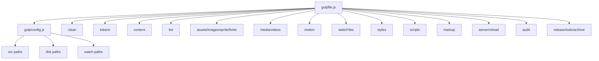
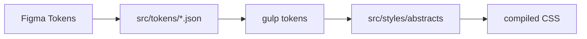

# DesignOps Orchestrator — Product and Engineering Case Study

> A comprehensive product, workflow, frontend-ops, design-system, build-pipeline, audit, release, and maintenance case study for the DesignOps Orchestrator repository. This document is intentionally detailed so designers, frontend engineers, maintainers, portfolio reviewers, and AI coding agents can understand the system without spelunking through every Gulp task like a doomed intern in a dependency cave.

## Table of Contents

1. [Executive Summary](#executive-summary)
2. [Repository Snapshot](#repository-snapshot)
3. [Product Context](#product-context)
4. [The DesignOps Problem](#the-designops-problem)
5. [Target Users](#target-users)
6. [Core Product Promise](#core-product-promise)
7. [Workflow Philosophy](#workflow-philosophy)
8. [System Architecture](#system-architecture)
9. [Build Pipeline Anatomy](#build-pipeline-anatomy)
10. [Source and Output Contracts](#source-and-output-contracts)
11. [Task Engine Inventory](#task-engine-inventory)
12. [Design Token Pipeline](#design-token-pipeline)
13. [Content Pipeline](#content-pipeline)
14. [Markup Pipeline](#markup-pipeline)
15. [Styles Pipeline](#styles-pipeline)
16. [Scripts Pipeline](#scripts-pipeline)
17. [Asset, Media, and Motion Pipelines](#asset-media-and-motion-pipelines)
18. [Audit and Quality Pipeline](#audit-and-quality-pipeline)
19. [Release and Admin Pipeline](#release-and-admin-pipeline)
20. [AI-Assisted Error Handling](#ai-assisted-error-handling)
21. [Configuration Strategy](#configuration-strategy)
22. [Environment and Secrets Strategy](#environment-and-secrets-strategy)
23. [Design-to-Code Handoff Strategy](#design-to-code-handoff-strategy)
24. [Accessibility Strategy](#accessibility-strategy)
25. [Performance Strategy](#performance-strategy)
26. [Security and Privacy Notes](#security-and-privacy-notes)
27. [Testing and Verification Strategy](#testing-and-verification-strategy)
28. [Maintenance Playbook](#maintenance-playbook)
29. [Risk Register](#risk-register)
30. [Roadmap](#roadmap)
31. [Portfolio Review Notes](#portfolio-review-notes)
32. [AI Coding Agent Notes](#ai-coding-agent-notes)
33. [Appendix A: Task Ownership Matrix](#appendix-a-task-ownership-matrix)
34. [Appendix B: Recommended Source Tree Contract](#appendix-b-recommended-source-tree-contract)
35. [Appendix C: Manual QA Matrix](#appendix-c-manual-qa-matrix)
36. [Appendix D: Suggested AGENTS.md](#appendix-d-suggested-agentsmd)
37. [Appendix E: Glossary](#appendix-e-glossary)
38. [Disclaimer](#disclaimer)

---

## Executive Summary

**DesignOps Orchestrator** is a modular Gulp 5 workflow for transforming design tokens, static content, markup, Sass, JavaScript/TypeScript, images, videos, icons, fonts, motion assets, audits, and release tasks into a structured frontend production pipeline.

The project is not trying to replace modern application frameworks such as Next.js, Astro, Vite, or Webpack. Instead, it focuses on the operational layer around frontend production: repetitive transformation, optimization, synchronization, validation, packaging, and reporting.

The core project value is simple:

> Reduce manual design-to-code friction by turning fragile handoff chores into repeatable build tasks.

The repository already contains a serious workflow skeleton. The root `gulpfile.js` imports modular task files, composes a production build with `clean`, token generation, content generation, linting, asset processing, style/script processing, and markup generation, then runs development mode with a local server and file watchers. The configuration file centralizes source, output, generated, and watch paths. The utility layer includes AI-assisted error explanation using Google GenAI when an API key is configured.

This case study turns that technical structure into a maintainable product and engineering story: why the system exists, who it serves, how each pipeline should behave, what source/output contracts must be protected, what risks exist, and how future maintainers should extend the workflow without converting it into dependency soup with badges.

---

## Repository Snapshot

| Attribute | Value |
|---|---|
| Repository | `Nischhalsubba/design-ops-orchestrator` |
| App type | DesignOps / frontend build-pipeline orchestrator |
| Runtime | Node.js |
| Task runner | Gulp `5.0.0` |
| Package version | `4.1.0` |
| Module system | ES modules |
| Package manager | npm `11.6.2` |
| Primary entry point | `gulpfile.js` |
| Configuration | `gulp/config.js` |
| Main source folder | `src/` |
| Main output folder | `dist/` |
| Report output | `reports/` |
| License | MIT |
| Maintainer | Nischhal Raj Subba |

### Confirmed commands

| Command | Purpose |
|---|---|
| `npm start` | Run default Gulp development workflow |
| `npm run build` | Run production build with `gulp build --production` |
| `npm run lint` | Run lint workflow |
| `npm run audit` | Run audit workflow |
| `npm run tokens` | Run token transformation task |
| `npm run todo` | Scan TODO-style tasks |
| `npm run release` | Run minor release/versioning workflow |
| `npm run test:a11y` | Run accessibility audit task |
| `npm run test:perf` | Run performance audit task |
| `npm run check` | Run lint and production build |

---

## Product Context

DesignOps is the operational discipline that connects design decisions to shipped product implementation. It deals with the boring middle where real teams lose time:

- design tokens need to become code variables
- exported icons need to become optimized sprites
- large media assets need responsive variants
- motion files need to land in the right runtime folder
- Markdown content needs to become page data
- Sass needs compiling, prefixing, grouping, and minifying
- JavaScript needs bundling and minification
- markup needs template data
- accessibility audits should run before release
- releases should be packaged consistently

None of these tasks is glamorous. That is exactly why they matter. The most expensive production problems are often not heroic architecture failures. They are tiny repeated handoff failures multiplied by deadlines, Slack threads, and the ancient human tradition of “I thought someone else updated that file.”

DesignOps Orchestrator exists to reduce those failures by making the workflow explicit, repeatable, and inspectable.

---

## The DesignOps Problem

Design and development drift occurs when the design source of truth and the production source of truth slowly separate.

### Common drift examples

| Drift type | Example | Result |
|---|---|---|
| Token drift | Figma color changed but SCSS token did not | UI mismatch |
| Asset drift | Designer exported new SVG but old sprite ships | stale icon |
| Content drift | Notion/Markdown updated but site data did not | stale copy |
| Audit drift | Accessibility check happens manually, rarely | late defects |
| Release drift | Zip/release packages made by hand | inconsistent builds |
| Motion drift | Lottie/Rive files copied manually | wrong animation version |
| Media drift | images converted manually | missing WebP/AVIF variants |

### The product problem

Manual workflows depend on memory. Memory is not an engineering system. It is a biological cache with anxiety.

### The engineering answer

Turn repeated operations into named tasks:

- `tokens`
- `content`
- `styles`
- `scripts`
- `markup`
- `images`
- `sprite`
- `motion`
- `audit`
- `release`

Named tasks create a shared language between designers and engineers. Instead of “can you update the design stuff,” a team can say “run the token task and rebuild styles.” Tiny difference, massive sanity upgrade.

---

## Target Users

### 1. Product designers who code

Designers who understand enough frontend to care about handoff quality can use this pipeline to make exports more reliable.

Needs:

- token transformation
- asset organization
- media optimization
- clear source folders
- repeatable output
- readable task names

### 2. Frontend developers

Developers need predictable input/output behavior and fast local workflows.

Needs:

- modular tasks
- source maps where useful
- production build mode
- linting
- server/watch mode
- reliable cleaning and output folders

### 3. Design system maintainers

Maintainers need a stable route from design tokens and assets to implementation-ready files.

Needs:

- token schema guidance
- generated output location
- change visibility
- release packaging
- versioning flow

### 4. Static-site builders

Teams building marketing pages, docs, portfolios, or static microsites can use the workflow without adopting a full app framework.

Needs:

- template markup
- Sass
- JS/TS bundling
- image conversion
- Markdown ingestion
- deployable `dist/`

### 5. QA and accessibility reviewers

Reviewers need audits as part of the normal workflow, not as an apology after launch.

Needs:

- accessibility checks
- performance checks
- HTML validation
- generated reports
- repeatable audit commands

### 6. Portfolio reviewers

Reviewers can see workflow thinking, not just visual output.

Needs:

- product framing
- architecture explanation
- pipeline map
- risk register
- maintenance notes
- design-to-code philosophy

---

## Core Product Promise

DesignOps Orchestrator promises to make frontend production workflows:

1. **Repeatable**
   - Common build operations become commands, not memory rituals.

2. **Modular**
   - Tokens, content, markup, assets, styles, scripts, audits, and releases are separate task engines.

3. **Design-aware**
   - The workflow understands design tokens, icons, motion assets, visual media, and content inputs.

4. **Quality-oriented**
   - Linting, accessibility, performance, and HTML validation are part of the pipeline.

5. **Framework-adjacent**
   - The system can support design-heavy static/frontend projects without replacing modern app frameworks.

6. **Auditable**
   - Source paths, output paths, and task behavior should be visible.

7. **Extensible**
   - New engines can be added without stuffing everything into one monstrous `gulpfile.js`.

---

## Workflow Philosophy

This repository treats Gulp as an orchestration layer.

That distinction matters. Gulp is not being used here as a trendy bundler. It is being used as a coordinator for file-based workflows that frontend teams still need even when modern frameworks exist.

### Good uses of this workflow

- static marketing websites
- design-system prototypes
- portfolio systems
- documentation sites
- asset-heavy frontend builds
- token-driven UI experiments
- content-driven static pages
- release packaging
- audit/report generation

### Bad uses

- tiny pages with no pipeline needs
- apps better handled by Next.js/Vite alone
- backend services
- projects where every task is bespoke and never repeated
- situations where a CMS or design-system platform already solves the problem

### Principle

Use automation when repetition creates risk. Do not automate chaos just because the tool menu is shiny.

---

## System Architecture

The architecture is modular.



### Core architectural files

| File | Role |
|---|---|
| `gulpfile.js` | central task composition and exported task API |
| `gulp/config.js` | production flag, banner, source paths, output paths, watch paths, BrowserSync config |
| `gulp/tasks/*.js` | modular task engines |
| `gulp/utils/ai-healer.js` | optional AI-assisted build error explanation |
| `src/` | source of truth for tokens, content, markup, styles, scripts, and assets |
| `dist/` | generated build output |
| `reports/` | audit/report output |

### Architecture strength

The system separates task definition from task composition. That makes it easier to update one engine without rewriting the entire workflow. The alternative is a 900-line Gulp file that nobody touches because it has achieved cursed artifact status.

---

## Build Pipeline Anatomy

The production `build` task is composed as:

```js
gulp.series(
  clean,
  gulp.parallel(tokens, content),
  lint,
  gulp.parallel(images, media, videos, sprite, fonts, motion, staticFiles),
  gulp.parallel(styles, scripts),
  markup
)
```

### Build stages

| Stage | Task group | Purpose |
|---|---|---|
| 1 | `clean` | remove stale output |
| 2 | `tokens`, `content` | generate derived design/content data |
| 3 | `lint` | check source quality |
| 4 | assets/media/motion/static | process external/static production assets |
| 5 | `styles`, `scripts` | compile and optimize code |
| 6 | `markup` | generate final HTML/templates using available data |

### Why order matters

Token and content tasks run early because styles and markup may depend on their generated output. Linting runs before heavier output processing. Markup runs after styles/scripts/assets because templates may reference generated files or manifests.

### Development mode

The default export runs:

```js
gulp.series(build, gulp.parallel(server, watch))
```

This means development starts with a complete build, then launches server and watch tasks together.

---

## Source and Output Contracts

The config file defines important contracts.

### Source paths

| Source | Path |
|---|---|
| tokens | `src/tokens/*.json` |
| content | `src/ingest/content/**/*.md` |
| styles | `src/styles/**/*.scss` |
| scripts | `src/scripts/**/*.{ts,js}` |
| markup | `src/markup/**/*.pug` |
| data | `src/data/*.json` |
| images | `src/assets/img/**/*` |
| icons | `src/assets/icons/*.svg` |
| fonts | `src/assets/fonts/**/*` |
| animations | `src/assets/animation/**/*.{json,riv}` |
| static | `src/static/**/*` |

### Output paths

| Output | Path |
|---|---|
| base | `dist` |
| CSS | `dist/css` |
| JS | `dist/js` |
| HTML | `dist` |
| images | `dist/assets/img` |
| fonts | `dist/assets/fonts` |
| sprites | `dist/assets/sprites` |
| animations | `dist/assets/animation` |
| reports | `reports` |

### Generated paths

| Generated file type | Path |
|---|---|
| generated tokens | `src/styles/abstracts` |
| generated content | `src/data` |

### Contract rule

If a task changes where it reads or writes, update `gulp/config.js` and README/docs together. Build pipelines rot when paths become folk knowledge. Folk knowledge is just documentation that got lazy.

---

## Task Engine Inventory

### Token engine

Transforms token JSON into styling artifacts.

Useful for:

- Figma Tokens Studio exports
- design-system variables
- Sass maps or variables
- theme foundations

### Content engine

Transforms Markdown/frontmatter into structured site data.

Useful for:

- articles
- documentation pages
- portfolio entries
- release notes
- changelog fragments

### Markup engine

Generates HTML from Pug/templates and data.

Useful for:

- static pages
- reusable template layouts
- content-driven builds

### Styles engine

Compiles Sass and processes CSS.

Useful for:

- Sass architecture
- PostCSS workflows
- autoprefixing
- minification
- production optimization

### Scripts engine

Processes JavaScript/TypeScript.

Useful for:

- transpilation
- bundling
- minification
- source maps where configured

### Asset/media/motion engines

Handle visual and motion files.

Useful for:

- image optimization
- WebP/AVIF
- SVG sprites
- fonts
- videos
- Lottie/Rive assets

### Audit engine

Runs quality checks.

Useful for:

- accessibility
- performance
- HTML validation
- Lighthouse-style reporting
- Pa11y-style checks

### Admin/release engine

Handles operational tasks.

Useful for:

- release packaging
- version bumps
- TODO scanning
- archive/zip creation

---

## Design Token Pipeline

Design tokens are one of the strongest reasons for this repo to exist.

### Input

```text
src/tokens/*.json
```

### Output

```text
src/styles/abstracts
```

### Product value

Design tokens create a shared vocabulary between Figma and code:

- colors
- spacing
- typography
- radii
- shadows
- z-index values
- breakpoints
- semantic aliases

### Recommended token rules

1. Prefer semantic tokens over raw-only tokens.
2. Preserve source token names where practical.
3. Generate predictable Sass output.
4. Keep generated files clearly marked.
5. Do not hand-edit generated token files.
6. Validate JSON before transformation.

### Example token workflow



---

## Content Pipeline

The content engine turns Markdown/frontmatter into structured data.

### Input

```text
src/ingest/content/**/*.md
```

### Output

```text
src/data
```

### Recommended frontmatter

```yaml
---
title: My Article
date: 2026-01-01
tags: [design, ops]
status: published
---
```

### Content rules

- Validate required frontmatter.
- Generate stable slugs.
- Preserve dates in ISO format.
- Sanitize or escape rendered content where needed.
- Avoid mixing draft and production content silently.
- Keep generated data reproducible.

### Good use cases

- blog pages
- case studies
- documentation pages
- release notes
- content blocks for marketing pages

---

## Markup Pipeline

The markup pipeline generates HTML from templates and data.

### Input

```text
src/markup/**/*.pug
src/data/*.json
```

### Output

```text
dist
```

### Recommended markup rules

- Keep layout templates separate from page content.
- Use shared partials for repeated UI.
- Keep data-driven sections predictable.
- Validate required data before rendering.
- Avoid embedding production secrets in templates.

### Common failure modes

- missing generated data
- invalid Pug syntax
- broken include paths
- stale partials
- output files overwritten unexpectedly

---

## Styles Pipeline

The styles pipeline compiles Sass and PostCSS-based CSS output.

### Input

```text
src/styles/**/*.scss
```

### Output

```text
dist/css
```

### Recommended style responsibilities

- Sass compilation
- Sass globbing
- autoprefixing
- media query grouping
- minification
- PurgeCSS if configured carefully
- source maps where useful

### CSS risk areas

| Risk | Why it matters | Mitigation |
|---|---|---|
| PurgeCSS removes dynamic classes | UI breaks | Safelist dynamic patterns |
| generated tokens overwritten | manual edits lost | mark generated files clearly |
| Sass import order changes | cascade bugs | document structure |
| minification hides debug context | hard to inspect | keep dev sourcemaps |

---

## Scripts Pipeline

The scripts pipeline processes JavaScript and TypeScript source.

### Input

```text
src/scripts/**/*.{ts,js}
```

### Output

```text
dist/js
```

### Possible responsibilities

- Babel transpilation
- TypeScript compilation
- ESBuild bundling
- minification
- debug stripping
- source maps
- concatenation if required

### Script rules

- Keep browser code isolated from build scripts.
- Avoid leaking environment secrets into client output.
- Keep entry points explicit.
- Validate TypeScript where practical.
- Ensure production minification does not break runtime assumptions.

---

## Asset, Media, and Motion Pipelines

These engines are the practical heart of DesignOps.

### Image pipeline

Handles:

- optimization
- WebP conversion
- AVIF conversion
- responsive image generation
- fallback handling

### SVG pipeline

Handles:

- SVG minification
- sprite generation
- icon output

### Font pipeline

Handles:

- font copying
- font output organization

### Video/media pipeline

Handles:

- media copying
- video processing direction
- future compression hooks

### Motion pipeline

Handles:

- Lottie JSON
- Rive `.riv` files
- animation asset output
- optional manifest workflows

### Asset rule

Source assets belong in `src/`. Generated assets belong in `dist/`. Do not edit generated assets by hand unless you enjoy losing changes while pretending the computer betrayed you.

---

## Audit and Quality Pipeline

The repo includes dependencies for accessibility, performance, HTML validation, Lighthouse, Pa11y, style linting, script linting, and Pug linting.

### Audit goals

- catch accessibility failures earlier
- catch performance regressions earlier
- validate generated HTML
- make quality visible before release
- normalize audit execution as a command

### Audit commands

| Command | Purpose |
|---|---|
| `npm run audit` | run audit pipeline |
| `npm run test:a11y` | run accessibility audit |
| `npm run test:perf` | run performance audit |

### Audit requirements

Audits often require:

- built output
- running local server
- reachable target URL
- installed browser dependencies
- stable HTML output

### Audit limitation

Automated accessibility tests are not a full accessibility review. They catch many issues and miss many others. A tool can tell you an image has no alt text. It cannot tell you your entire information architecture feels like a tax form designed by a haunted printer.

---

## Release and Admin Pipeline

The admin tasks include release, TODO scanning, and archive support.

### Useful release responsibilities

- bumping version
- tagging release
- generating zip/archive
- scanning TODOs
- packaging `dist/`
- preparing changelog fragments

### Release command

```bash
npm run release
```

Currently mapped to:

```bash
gulp release --type minor
```

### Release caution

Any task that changes version numbers, tags, or archives should be reviewed before automation is used in public CI. Release automation is powerful. It is also how people accidentally publish chaos with semantic versioning.

---

## AI-Assisted Error Handling

The repository includes `gulp/utils/ai-healer.js`, which sends task errors to a Google GenAI model when `API_KEY` is configured.

### Intended purpose

The AI helper is a developer-assistance layer. It can explain build errors, summarize likely causes, and suggest fixes.

### It should not be treated as

- a source of truth
- an automatic patcher
- a replacement for reading stack traces
- a security scanner
- a release gate

### Important safety notes

The helper may send error messages and stack traces to an external AI service. Build errors can include:

- local file paths
- source code snippets
- environment references
- dependency names
- internal project structure

Before using it in a private or client project, decide whether that data can be sent externally.

### Recommended guardrails

- document that AI helper is optional
- never send `.env` values
- redact secrets from errors if possible
- disable AI helper in CI unless explicitly approved
- keep fallback behavior when API key is missing

---

## Configuration Strategy

`gulp/config.js` is the workflow contract.

### What it controls

- production mode detection
- generated banner
- source paths
- output paths
- generated intermediate paths
- watch paths
- BrowserSync configuration

### Why this matters

Centralized config prevents task files from quietly disagreeing about where files live.

### Config rules

1. Add new paths to config before using them in tasks.
2. Keep `src`, `dist`, `generated`, and `watch` sections aligned.
3. Avoid hardcoded paths inside task files where possible.
4. Keep BrowserSync config readable.
5. Review config whenever adding a new task engine.

---

## Environment and Secrets Strategy

The README documents optional environment variables:

```env
API_KEY=your_google_genai_key_here
ANALYTICS_ID=G-XXXXXXXXXX
```

### Environment rules

- Do not commit real `.env` files.
- Add `.env.example` for onboarding.
- Treat `API_KEY` as sensitive.
- Avoid exposing secrets to client bundles.
- Document which tasks use which variables.

### Recommended `.env.example`

```env
# Optional Google GenAI key for AI-assisted build error explanation.
API_KEY=

# Optional analytics ID for generated static output if a project uses analytics injection.
ANALYTICS_ID=
```

---

## Design-to-Code Handoff Strategy

The strongest product story here is design-to-code handoff.

### Supported handoff inputs

| Source | Export | Destination |
|---|---|---|
| Figma | token JSON, SVG | `src/tokens`, `src/assets/icons` |
| Sketch | JSON, SVG | `src/tokens`, `src/assets/icons` |
| Notion | Markdown | `src/ingest/content` |
| Obsidian | Markdown | `src/ingest/content` |
| Photoshop | JPG/PNG | `src/assets/img` |
| Illustrator | SVG | `src/assets/icons` |
| After Effects / Bodymovin | Lottie JSON | `src/assets/animation` |
| Rive | `.riv` | `src/assets/animation` |

### Handoff rule

Design exports should land in predictable source folders. The build system should transform them into production assets. Humans should not manually compress, rename, copy, and pray. Prayer is not a file pipeline.

---

## Accessibility Strategy

Accessibility is treated as a build concern, not only a design-review concern.

### Pipeline support

- `gulp-a11y`
- `gulp-accessibility`
- Pa11y
- Lighthouse
- HTML validation

### Accessibility tasks should check

- alt text
- heading order
- form labels
- color contrast
- landmark structure
- keyboard navigation issues where detectable
- HTML validity

### Manual checks remain necessary

Automated tooling cannot fully evaluate:

- interaction clarity
- focus management in complex UI
- screen-reader meaning
- cognitive load
- content hierarchy
- real keyboard flow

### Accessibility principle

Make accessibility a repeatable task and a human review responsibility. One without the other is performative compliance cosplay.

---

## Performance Strategy

Performance tooling includes Lighthouse, image optimization, minification, critical CSS workflows, compression tools, and responsive image generation direction.

### Performance goals

- optimize images by default
- generate modern formats where useful
- minify CSS and JS in production
- reduce unused CSS where safe
- run Lighthouse-style audits
- create reproducible performance reports

### Watch areas

| Area | Risk | Control |
|---|---|---|
| PurgeCSS | removes dynamic classes | safelist patterns |
| image generation | slow builds | cache/newer checks |
| AVIF/WebP | compatibility needs fallback | preserve originals/fallbacks |
| critical CSS | wrong extraction | test generated pages |
| JS minification | runtime breakage | dev/prod comparison |

---

## Security and Privacy Notes

### Secrets

The optional AI helper uses an API key. Keep it out of source control.

### External requests

The AI helper may send error context externally. Document this behavior for client or private projects.

### Generated output

Do not inject secrets into markup or scripts. Environment variables should be reviewed before use in any generated client artifact.

### Dependency risk

This repo includes many build dependencies. That increases maintenance and audit surface.

Recommended actions:

- run dependency audits periodically
- remove unused packages where possible
- document which task uses which dependency
- pin runtime versions for CI

---

## Testing and Verification Strategy

### Current check command

```bash
npm run check
```

This runs:

```bash
npm run lint && npm run build
```

### Verification layers

| Layer | Command | Purpose |
|---|---|---|
| lint | `npm run lint` | source/task quality checks |
| build | `npm run build` | production output generation |
| audit | `npm run audit` | quality and audit reports |
| accessibility | `npm run test:a11y` | accessibility audit task |
| performance | `npm run test:perf` | performance audit task |
| tokens | `npm run tokens` | token pipeline check |

### Suggested future tests

- validate config paths exist
- validate token JSON input
- validate Markdown frontmatter
- verify output folders after build
- snapshot generated content data
- smoke test default Gulp workflow
- verify AI helper fails gracefully without key

---

## Maintenance Playbook

### Add a new task engine

1. Create task file under `gulp/tasks/`.
2. Add required paths to `gulp/config.js`.
3. Export the task from the task file.
4. Import it in `gulpfile.js`.
5. Add it to build/watch flow only where needed.
6. Add npm script if user-facing.
7. Document source/output contract.
8. Add troubleshooting notes.

### Update an existing pipeline

1. Inspect task file and config paths.
2. Confirm source inputs.
3. Confirm generated outputs.
4. Run the isolated task.
5. Run full build.
6. Check generated output.
7. Update docs.

### Add a new source folder

1. Add to `gulp/config.js`.
2. Add to relevant task.
3. Add to watch config if needed.
4. Update README/docs.
5. Add example file if useful.

### Before release

```bash
npm install
npm run check
npm run audit
npm run release
```

Only run release automation after reviewing what it changes. Computers are fast. That is not the same as wise.

---

## Risk Register

| Risk | Severity | Why it matters | Mitigation |
|---|---:|---|---|
| Dependency bloat | High | Many packages increase maintenance burden | map dependencies to tasks, remove unused |
| AI helper leaks sensitive info | High | errors may include paths/code/secrets | redact, document, make opt-in |
| Generated files edited manually | Medium | changes lost on rebuild | label generated outputs |
| Config path drift | High | tasks read/write wrong folders | centralize paths in config |
| PurgeCSS removes needed CSS | Medium | production UI breaks | safelist dynamic classes |
| Asset tasks slow builds | Medium | poor developer experience | cache/newer checks |
| Release task changes too much | High | accidental version/archive changes | dry-run/review release output |
| Audit task false confidence | Medium | automated checks miss issues | pair with manual QA |
| Token schema changes | High | styles break downstream | validate token input |
| Markdown frontmatter gaps | Medium | content generation fails | require schema validation |
| BrowserSync output stale | Low | dev sees old files | clean/rebuild and watch paths |

---

## Roadmap

### Near term

- Add `.env.example`.
- Add sample token file.
- Add sample Markdown content.
- Add sample Pug page.
- Add generated output screenshots.
- Document each task file in `/docs`.
- Add dependency-to-task map.

### Mid term

- Add validation for token JSON.
- Add frontmatter validation.
- Add generated manifest examples.
- Add CI workflow example.
- Add release dry-run mode.
- Add AI helper privacy redaction.
- Add task-level timing output.

### Long term

- Add starter templates for common project types.
- Add full example site using every pipeline.
- Add visual reports dashboard.
- Add plugin-style task registration.
- Add design-token diff reports.
- Add accessibility/performance trend tracking.

---

## Portfolio Review Notes

This repository is valuable as a portfolio project because it demonstrates workflow thinking beyond UI screens.

### Strong portfolio angles

- design-to-code handoff automation
- design token transformation
- frontend build orchestration
- asset optimization
- quality/audit integration
- release operations
- designer-engineer collaboration
- AI-assisted developer tooling with privacy caveats

### Strong portfolio summary

> Built a modular Gulp 5 DesignOps pipeline that orchestrates design tokens, Markdown content, Pug markup, Sass, JavaScript/TypeScript, images, SVG sprites, motion assets, accessibility/performance audits, and release packaging. The project shows how design artifacts can move into production workflows through repeatable tasks rather than fragile manual handoff.

### What not to overclaim

Do not claim:

- this replaces modern app frameworks
- every task is production-proven without examples
- AI helper automatically fixes build errors
- automated audits guarantee accessibility
- token conversion works for every possible token schema

A good portfolio explains tradeoffs. A bad one turns every repo into a heroic epic. Please, civilization has suffered enough LinkedIn storytelling.

---

## AI Coding Agent Notes

Future AI agents should treat this as a build pipeline with source/output contracts, not as a generic JavaScript app.

### Inspect first

1. `README.md`
2. `package.json`
3. `gulpfile.js`
4. `gulp/config.js`
5. `gulp/tasks/`
6. `gulp/utils/ai-healer.js`
7. `src/tokens/`
8. `src/ingest/content/`
9. `src/styles/`
10. `src/markup/`
11. `src/scripts/`
12. output/report configuration

### Do not

- Do not hardcode paths inside tasks when config can own them.
- Do not edit generated output as source.
- Do not send secrets to AI helper.
- Do not add build dependencies without mapping them to tasks.
- Do not modify release automation casually.
- Do not assume audits replace manual QA.

### Prefer

- small isolated task changes
- source/output documentation
- config-first path updates
- task-level error handling
- explicit production behavior
- clear generated-file warnings

---

## Appendix A: Task Ownership Matrix

| Task | Owner concern | Source | Output |
|---|---|---|---|
| `tokens` | design systems | `src/tokens/*.json` | `src/styles/abstracts` |
| `content` | content/design | `src/ingest/content/**/*.md` | `src/data` |
| `markup` | frontend/templates | `src/markup/**/*.pug` | `dist` |
| `styles` | frontend/design systems | `src/styles/**/*.scss` | `dist/css` |
| `scripts` | frontend engineering | `src/scripts/**/*.{ts,js}` | `dist/js` |
| `images` | visual/media | `src/assets/img/**/*` | `dist/assets/img` |
| `sprite` | icons/design systems | `src/assets/icons/*.svg` | `dist/assets/sprites` |
| `motion` | motion design | `src/assets/animation/**/*` | `dist/assets/animation` |
| `audit` | QA/accessibility/performance | built site | `reports` |
| `release` | maintainers | `dist/package metadata` | archive/version/tag output |

---

## Appendix B: Recommended Source Tree Contract

```text
src/
  assets/
    animation/       # Lottie JSON and Rive files
    fonts/           # source font files
    icons/           # raw SVG icons
    img/             # source images
    video/           # source videos
  data/              # generated or authored JSON data
  ingest/
    content/         # Markdown/frontmatter input
  markup/            # Pug templates/pages
  scripts/           # JS/TS browser source
  styles/            # SCSS source and generated token partials
  static/            # copied static files
  tokens/            # design token JSON exports
```

---

## Appendix C: Manual QA Matrix

| Area | Test | Expected result |
|---|---|---|
| install | `npm install` | dependencies install |
| build | `npm run build` | `dist/` generated |
| dev | `npm start` | build, server, watch begin |
| lint | `npm run lint` | lint tasks complete or report issues |
| tokens | `npm run tokens` | generated token output updated |
| content | content task | Markdown becomes structured data |
| styles | style task | CSS generated in `dist/css` |
| scripts | script task | JS generated in `dist/js` |
| images | image task | optimized images output |
| sprite | sprite task | SVG sprite output generated |
| motion | motion task | animation files copied/optimized |
| audit | `npm run audit` | reports generated or useful errors shown |
| AI helper | missing API key | fails gracefully |
| release | release task | version/archive behavior reviewed |

---

## Appendix D: Suggested AGENTS.md

```md
# Repository Instructions

## Setup

Run `npm install` before using the workflow. Use Node.js 22 or newer and npm 10 or newer.

## Commands

- `npm start`: run the default development workflow.
- `npm run build`: run the production build.
- `npm run lint`: run lint tasks.
- `npm run audit`: run audit tasks.
- `npm run tokens`: regenerate design-token outputs.
- `npm run check`: run lint and production build.

## Coding conventions

- Keep source files under `src/`.
- Keep generated output under `dist/` or configured generated folders.
- Add paths to `gulp/config.js` before using them in tasks.
- Keep task files modular under `gulp/tasks/`.
- Do not hardcode repeated paths inside task files.

## Testing and verification

After changing a task, run the task directly when possible, then run `npm run check`.
For audit or accessibility changes, run `npm run audit`, `npm run test:a11y`, or `npm run test:perf` as appropriate.

## Do not

- Do not commit real `.env` secrets.
- Do not edit generated files as source.
- Do not send sensitive errors or secrets through the AI helper.
- Do not modify release automation without checking output behavior.
- Do not assume automated audits replace manual QA.
```

---

## Appendix E: Glossary

| Term | Meaning |
|---|---|
| DesignOps | Operational practice connecting design decisions to production workflows |
| Gulp | JavaScript task runner used for file-based build automation |
| Task engine | A modular group of build tasks for one workflow area |
| Design token | Named design value such as color, spacing, typography, or radius |
| Source contract | Agreed location and shape of source files |
| Output contract | Agreed destination and shape of generated files |
| Frontmatter | YAML metadata at the top of Markdown files |
| Sprite | Combined SVG icon output |
| Lottie | JSON animation format often exported from After Effects via Bodymovin |
| Rive | Interactive animation format/tool |
| BrowserSync | Local development server with reload support |
| Pa11y | Accessibility testing tool |
| Lighthouse | Web performance and quality audit tool |
| Generated file | File produced by the build process, not meant for manual editing |

---

## Disclaimer

DesignOps Orchestrator is a workflow and automation project. It should be adapted carefully for each production context. Build scripts can transform, delete, overwrite, minify, package, and publish files, so review task behavior before using the workflow in client projects, CI systems, or release pipelines.

The optional AI-assisted error helper may send error context to an external AI provider when configured. Do not use that helper with sensitive source code, secrets, private client data, or proprietary stack traces unless the data-sharing implications are understood and accepted.
